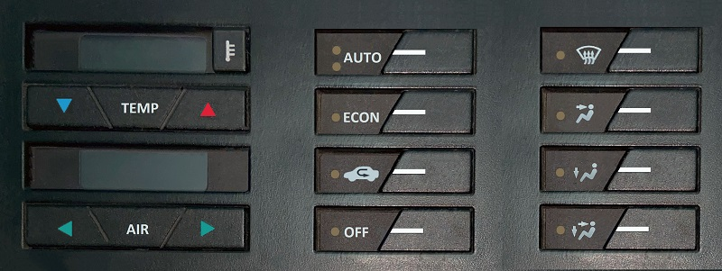

# ElectronicACUnitAVR8 - Web Application

Fiat Tempra 2.0cc Electronic Air Conditioner Centralina with AVR8 MCU.  

Web Application is a simple angular 2.x SPA and .NET Core 3.x Web Server for testing Centralina UI.  

  

## Documentation is located at <https://github.com/JonathanLugo7/ElectronicACUnitAVR8/tree/main/Documentation>
