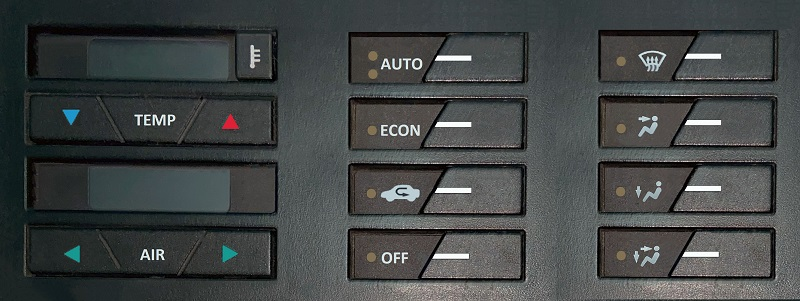

# ElectronicACUnitAVR8 - MPLAB X

Fiat Tempra 2.0cc Electronic Air Conditioner Centralina with AVR8 MCU.  

Centralina main C code ported to Microchip MPLAB X 6.x IDE.  

  

## Documentation is located at <https://github.com/JonathanLugo7/ElectronicACUnitAVR8/tree/main/Documentation>
