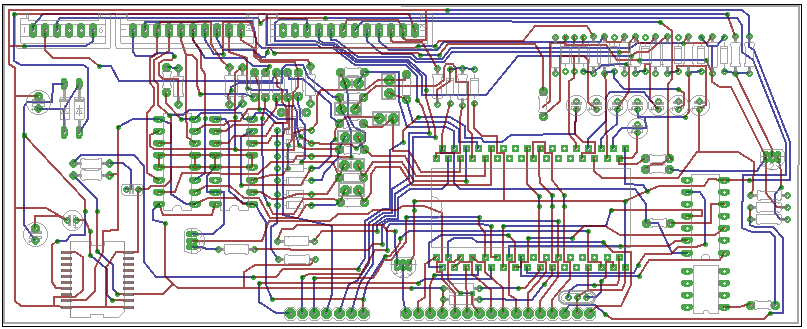
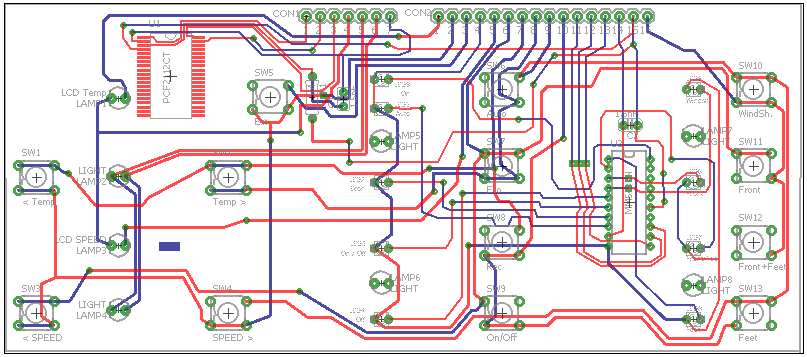

# ElectronicACUnitAVR8 - Eagle Files

Fiat Tempra 2.0cc Electronic Air Conditioner Centralina with AVR8 MCU.  

Main board, UI board and blower PWM controller eagle 7.5.x files.  

  

## Main board

  

## UI board

  

## Documentation is located at <https://github.com/JonathanLugo7/ElectronicACUnitAVR8/tree/main/Documentation>
