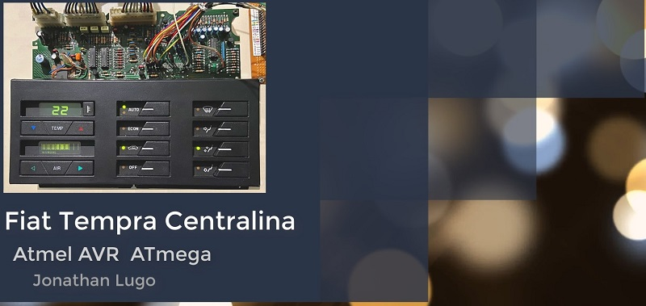

# ElectronicACUnitAVR8 Project

## Welcome

Fiat Tempra 2.0cc Electronic Air Conditioner Centralina with AVR8 MCU.  

Replacing the NEC uPD78C18 MCU with the Atmel Atmega16A AVR8 MCU.  

  

## Pre-requisites

* .NET Core 3.x SDK
* Angular 2.x
* Atmel Studio 7 IDE
* Microchip MPLAB X 6 IDE
* Eagle 7.5
* Arduino IDE as ISP Programmer

## Get Help

* <https://github.com/JonathanLugo7/ElectronicACUnitAVR8/tree/main/Documentation>

## Stay Informed

* [YouTube](https://www.youtube.com/channel/UC0mKs7vNITJ_Hd6y4ThR0bQ)
